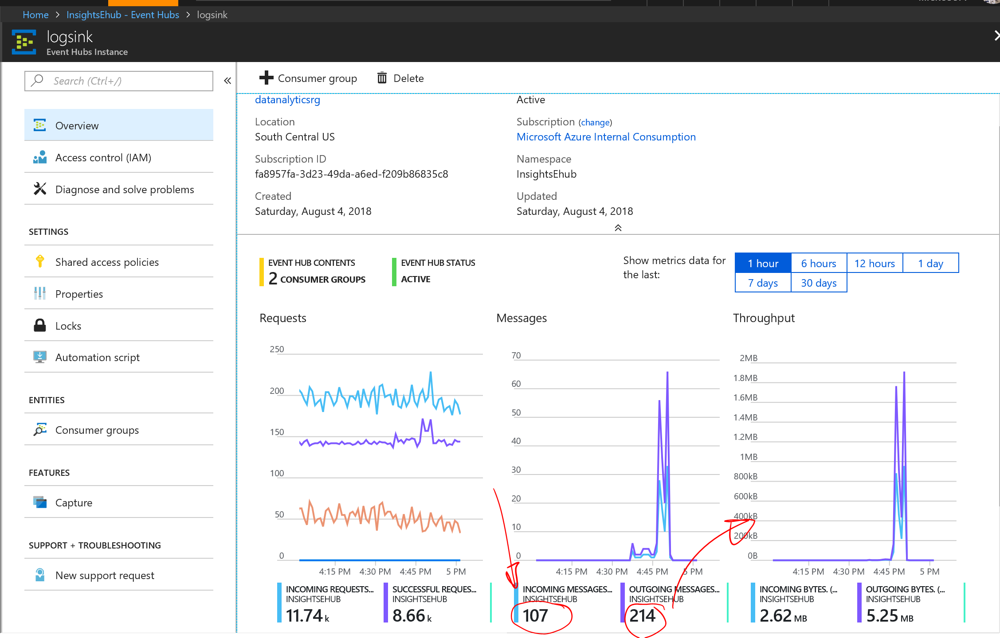
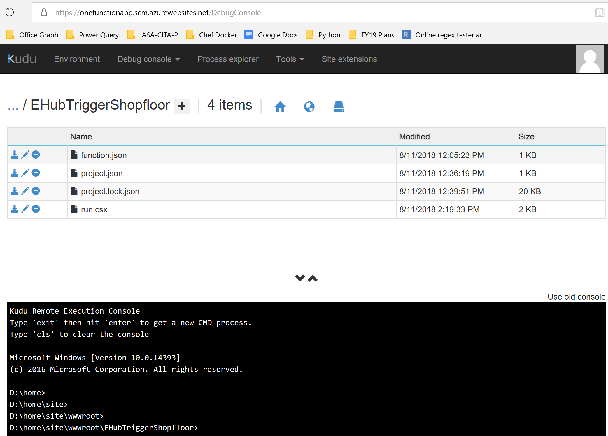
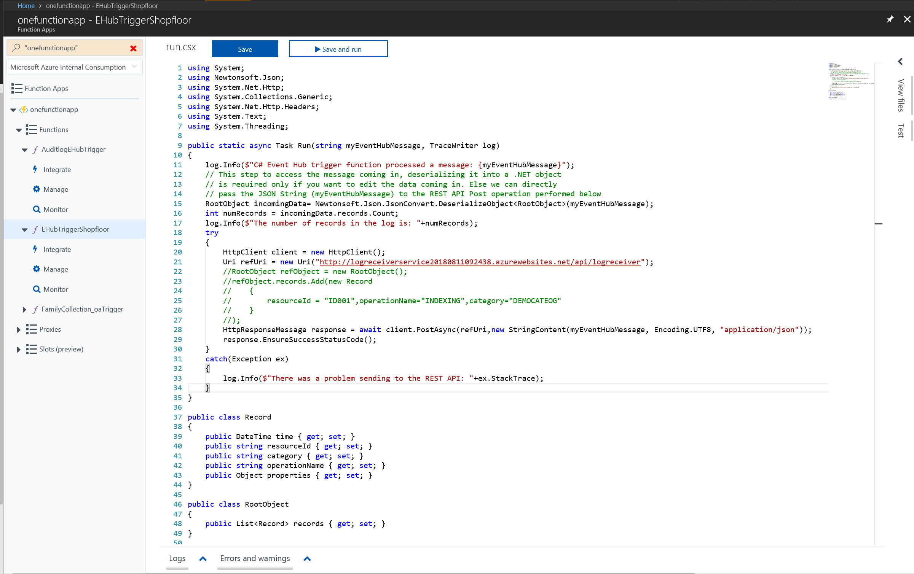
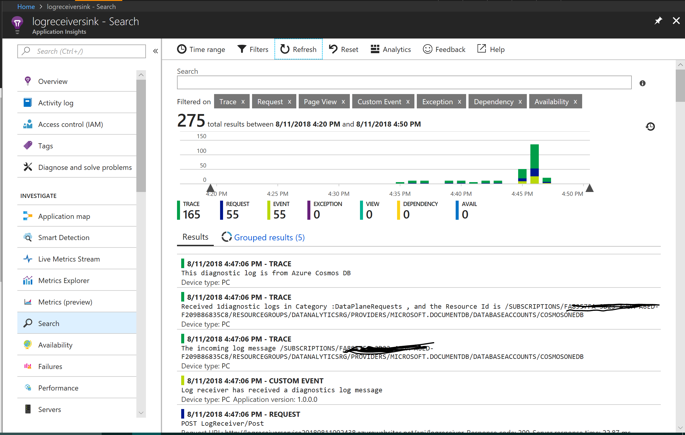

# logs-ehub-sink
Sample that uses Event Hubs as a common sink for Diagnostic Logs across Azure Services. Azure Functions uses an input trigger from Event Hubs to pick the log messages and sends them to a custom REST Service

## Streaming diagnostic logs from Azure Monitor
Diagnostic logs from different Azure Services can be streamed to Log Analytics, or to Azure Event Hubs, using Azure Monitor. This article - https://docs.microsoft.com/en-us/azure/monitoring-and-diagnostics/monitoring-stream-diagnostic-logs-to-event-hubs - has the guidance.
For this sample, Azure Monitor was configured to stream logs from a Cosmos DB Service and Azure Search Service.
An Event Hub namespace + Event Hub endpoint have to exist to complete the above step.
After configuring the diagnostics, navigate to the Event Hub end point and in the metrics view, ensure the 'Messages' part shows incoming messages. The outgoing messages metrics will show up only after client consumers (Azure Functions in this example) are configured.

## Deploy the custom REST Service to receive the logs from Azure Functions
This is a simple ASP.NET Core 2.0 Web API project that will receive the Logs coming in from Azure Functions (configured in the next section below). This is to mimic a third party Solution that would want to handle Diagnostic logs.
The Visual Studio 2017 Project is included in this repository.
This custom code uses Application Insights to send the trace information. 
To view the telemetry when running this sample, create an Application Inisights resource in Azure, and enter its Security key inside the appsettings.json file of the Project. Publish this Project to a Web App in Azure. The URL of the LogReceiverController Service would be required in the next section below, in the Function App.

## Create an Azure Function (Event Hub Consumer)
Create a new Azure Function App (version 1.x is used in this example) and configure an input trigger on the EVent Hub created in the earlier steps. This link https://docs.microsoft.com/en-us/azure/azure-functions/functions-create-first-azure-function pertains to configuring a HTTP Trigger, but the steps for Event Hub input triggers are similar.

Copy the code from folder "Azure Functions Code\run.cs", available in this repository, into the Function app's run.csx editor in the Azure Portal.

Since this code depends on additional packages to run, create a Project.JSON file in the Kudu console of the Function App, and copy the content of the Project.json file included in this repository. After it is saved, restart the Function App from the Azure Portal.
Ensure the Log console on the Function's run.csx file indicates it has successfully compiled and is running.
The Messages from Event Hubs should be visible in this console.

Update the URL of the custom REST Service in the run.csx to send the Messages to (from the previous section).

Refer to these links below to understand how to develop applications using Azure Functions.
https://docs.microsoft.com/en-us/azure/azure-functions/functions-reference#fileupdate
https://docs.microsoft.com/en-us/azure/azure-functions/functions-develop-local

## View the Application Insights Telemetry
View the Trace in Application Insights to ensure the Diagnostics Logs were received from the Function App.

